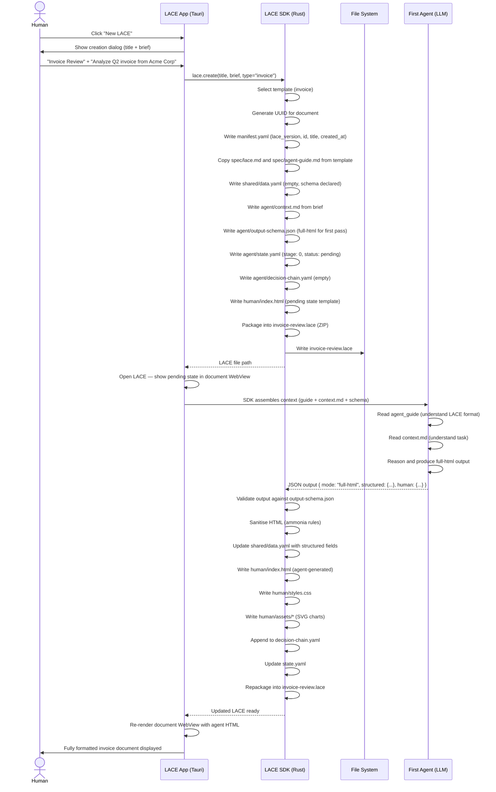
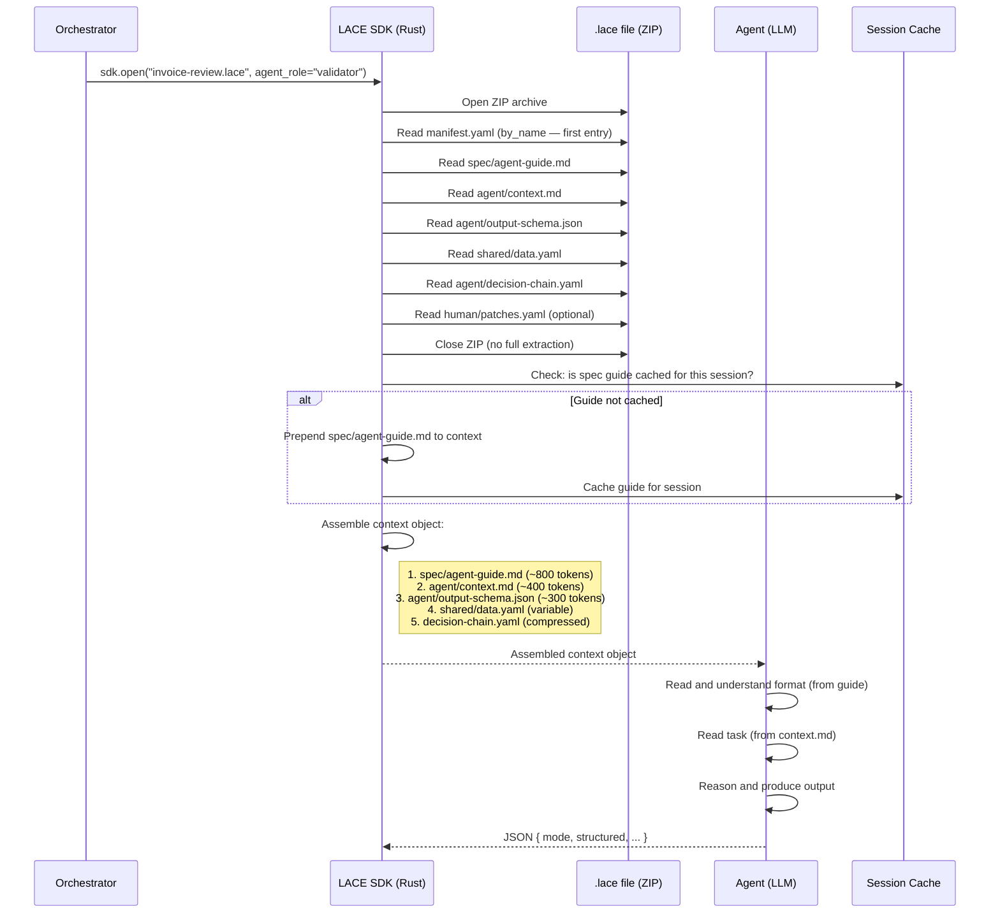
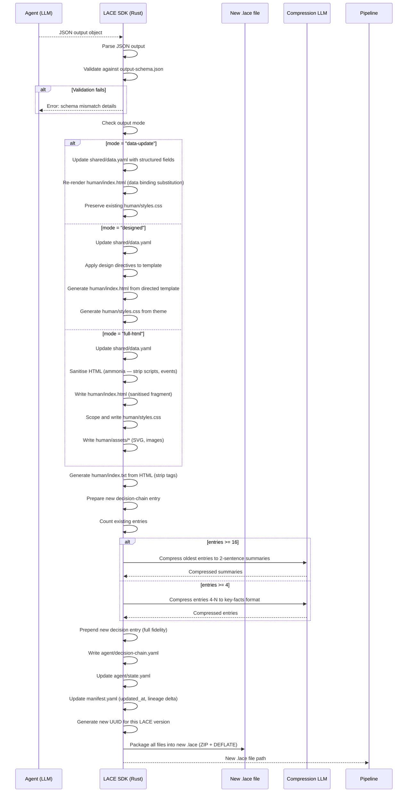
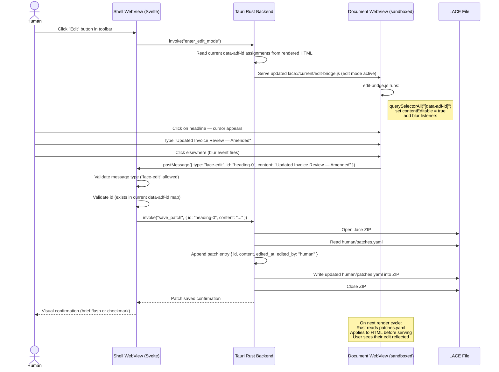
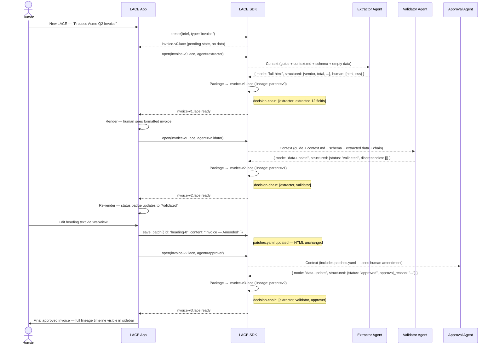
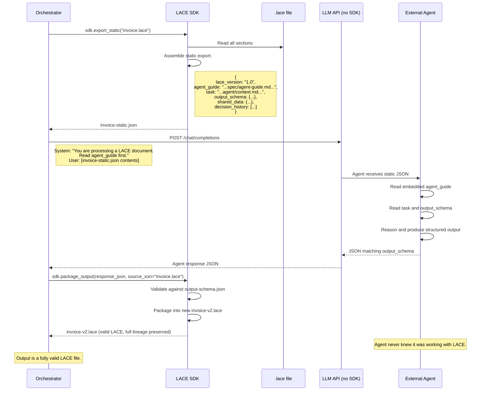
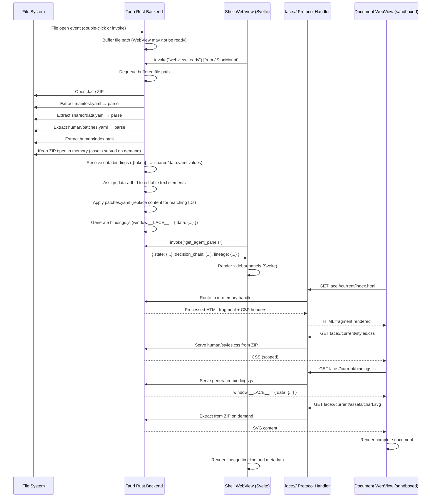
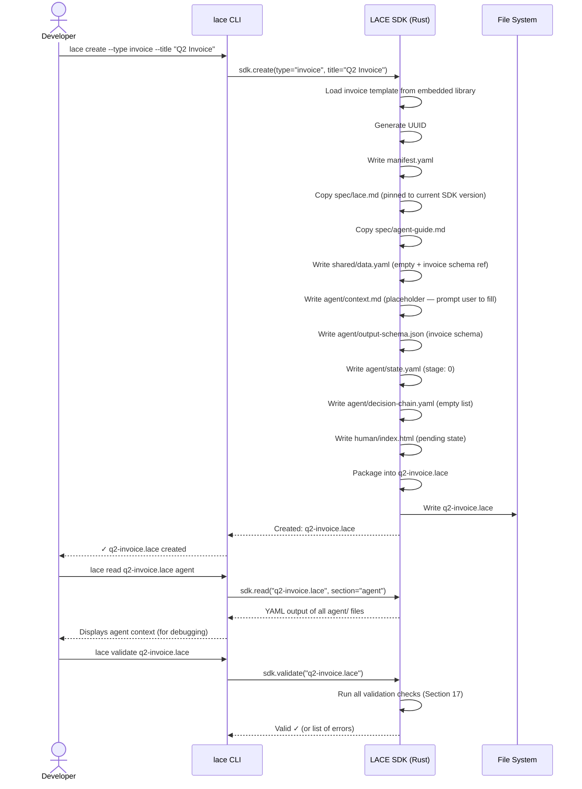

# LACE Sequence Diagrams

All diagrams use Mermaid syntax. Render with any Mermaid-compatible viewer (GitHub, Obsidian, Mermaid Live Editor).

---

## 1. First LACE Creation (Human-Initiated)

A human opens the app, clicks "New LACE", enters a title and brief. The SDK creates the container and a first-pass agent produces the initial document.

---

## 2. Agent Ingestion Flow (SDK Path)

How the SDK prepares context for an agent receiving an existing LACE file.

---

## 3. Agent Output and LACE Packaging

How the SDK validates and packages agent output into a new LACE file.

---

## 4. Human Edit Flow

How a user edits text in the rendered document WebView and how edits are persisted.

---

## 5. Multi-Agent Pipeline

A complete pipeline showing how LACE files flow through multiple agents, accumulating decisions and lineage.

---

## 6. Static Export (No-SDK Agent Path)

How an agent with no SDK access can still produce valid LACE output.

---

## 7. App Rendering Pipeline

How the Tauri app renders a LACE file in the document WebView.

---

## 8. LACE File Creation — CLI Path

How a developer creates a LACE from the command line.

